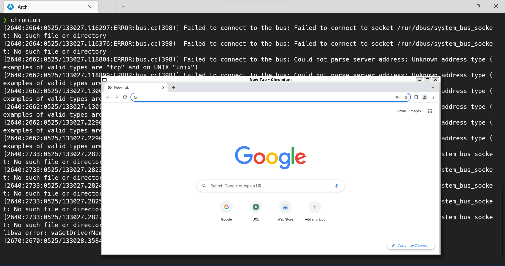
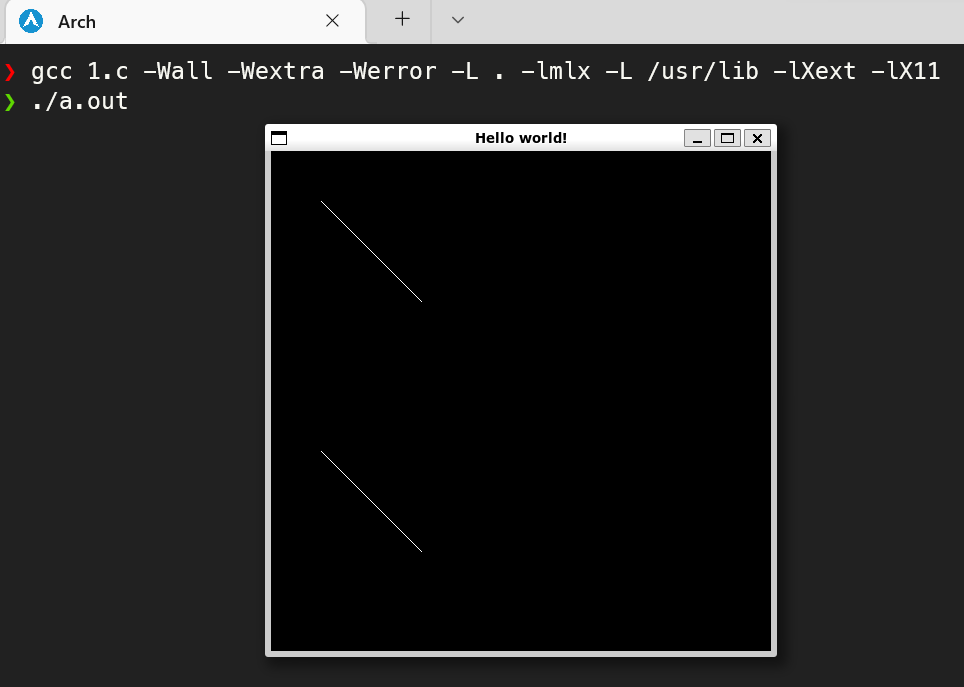

# so_long

## Environment Setup

### First things first
At the project's time, I'm (was) using a WIN11 with WSL2. On WSL2 I've installed an Arch Linux using this [repo](https://github.com/yuk7/ArchWSL) and this tutorial [video](https://www.youtube.com/watch?v=sjrW74Hx5Po&t=2676s).

WIN11 has a Linux GUI support for WSL2, so I simply follow this [doc](https://docs.microsoft.com/en-us/windows/wsl/tutorials/gui-apps):

1. Download and install the GPU driver for WSL.

2. Run the following commands on PowerShell as admin to update and restart the WSL2:

```PowerShell
wsl --update
wsl --shutdown
```
> :warning: I've an issue with my keyboard map on X Apps and poorly solve it using [xorg-setxkbmap](https://archlinux.org/packages/extra/x86_64/xorg-setxkbmap/) tool to set my keyboard as follow: `setxkbmap -model abnt2 -layout br -variant abnt2`

3. For test pourpose, I've intalled [chromium](https://archlinux.org/packages/extra/x86_64/chromium/).


### MiniLibX
> :book: [reference material](https://harm-smits.github.io/42docs/libs/minilibx) from [harmsmits](https://www.linkedin.com/in/harmsmits/)

"MiniLibX  is an easy way to create graphical software, without any X-Window programming knowledge. It provides simple window creation, a drawing tool, image and basic events management." - from `man mlx`.

#### Installation
> :bulb: double check if you have [libx11](https://archlinux.org/packages/extra/x86_64/libx11/) and [libxext](https://archlinux.org/packages/extra/x86_64/libxext/) installed

1. From the project subject, download the `minilibx-linux.tgz` [file](https://projects.intra.42.fr/uploads/document/document/8443/minilibx-linux.tgz).

2. `tar -zxvf minilibx-linux.tgz`.

3. Compile the lib running: `cd minilibx-linux && make`.

4. There's a test folder to check if everything is working: `cd test && ./run_tests.sh` or `cd test && ./mlx-test`.

5. I like to always do my own test (based on the reference material).
```c
#include "mlx.h"

typedef struct	s_data {
	void	*img;
	char	*addr;
	int	bits_per_pixel;
	int	line_length;
	int	endian;
}	t_data;

void	my_mlx_pixel_put(t_data *data, int x, int y, int color)
{
	char	*dst;

	dst = data->addr + (y * data->line_length + x * (data->bits_per_pixel / 8));
	*(unsigned int*)dst = color;
}

int	main()
{
	void	*mlx;
	void	*mlx_win;
	t_data	img;
	int	i;
	int 	j;

	mlx = mlx_init();
	mlx_win = mlx_new_window(mlx, 500, 500, "Hello world!");

	img.img = mlx_new_image(mlx, 500, 500);
	img.addr = mlx_get_data_addr(img.img, &img.bits_per_pixel, &img.line_length, &img.endian);
	
	i = -1;
	while (i++ < 100)
		my_mlx_pixel_put(&img, 50 + i, 50 + i, 0x00FFFFFF);
	j = -1;
	while (j++ < 100)
	{
		my_mlx_pixel_put(&img, 50 + j, 300 + j, 0x00FFFFFF);
	}

	mlx_put_image_to_window(mlx, mlx_win, img.img, 0, 0);

	mlx_loop(mlx);	

	return (0);
}
```
6. To run it: `gcc 1.c -Wall -Wextra -Werror -L . -lmlx -lXext -lX11 && ./a.out`


#### Lib files' setup

1. To have all MiniLibX files in the "default" paths:
   1. `cd minilibx-linux && mv man/man3/mlx* /usr/share/man/man3`
   2. `cd minilibx-linux && mv mlx.h /usr/include`
   3. `cd minilibx-linux && mv libmlx.a	/usr/lib`

2. Them, you can run the compiler without the options -L -I for these files: `gcc 1.c -Wall -Wextra -Werror -lmlx -lXext -lX11 && ./a.out`


## Makefile

Nothing new here, it's a pretty straight forward Makefile, but... as I've never explain it to myself, here we go!

The fisrt "half" of the file contains eigther the **aliases** for some commands or **variables** that will be consumed by Makefile. In my case:

| Alias | Command   | Description                                                                        |
| ----- | --------- | ---------------------------------------------------------------------------------- |
| CC    | cc -> gcc | C Compiler                                                                         |
| AR    | ar rcsv   | It will create an archive (aka lib, in this case) with all objects compiled before |
| RM    | rm -rf    | Remove command                                                                     |

| Varialbe       | Content               | Description                               |
| -------------- | --------------------- | ----------------------------------------- |
| CC_FLAGS       | -Wall -Wextra -Werror | Mandatory C warning flags for 42 projects |
| MLX_FLAGS      | -lmlx -lXext -lX11    | MiniLibX C lib linking flags              |
| LIBFT_LIB      | libft/libft.a         | Path to Libft archive (or lib :smile:)    |
| LIBFT_HEADER   | -I libft              | Path to Libft header file                 |
| LIBFT_LIB_LINK | -L libft -l:libft.a   | Explicity C lib linkig flag to Libft lib  |
| SRCS           | *.c                   | All C source files for the project        |
| OBJS           | $(SRCS:.c=.o)         | Result $() %.c to %.o compilation process |
| NAME           | so_long               | Project name :video_game:                 |

The second part, contains de **recipes**. A recipe could have a pre-req rule and will have it's commads:

| Recipe | Content                                               | Description |
| ------ | ----------------------------------------------------- | ----------- |
| .c.o:  | $(CC) $(CC_FLAGS) $(LIBFT_HEADER) -c $< -o $(<:.c=.o) | bla bla bla |